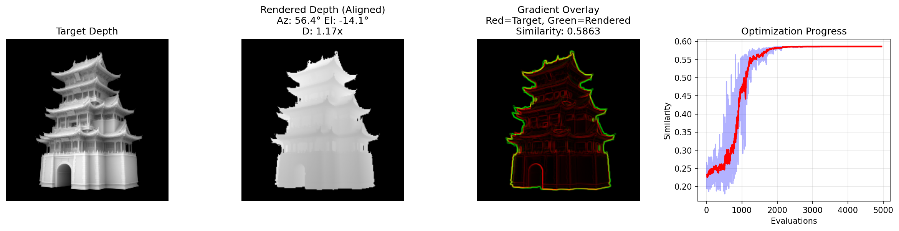

# 6D Pose Estimation

基于分析合成方法的6D位姿估计工具，使用CMA-ES优化算法将3D网格模型与2D目标图像对齐，估计相机的方位角、仰角和距离参数。

## 📋 依赖安装

```bash
pip install pyrender trimesh cma opencv-python numpy matplotlib
```

## 🚀 快速开始

### 1. 准备文件

```
pose_estimation/
├── pose_estimation.py   # 主程序
├── model.glb            # 3D模型文件
├── target.png           # 目标图像（灰度深度图）
└── output/              # 输出目录（自动创建）
```

### 2. 配置参数

在 `pose_estimation.py` 文件开头修改：

```python
MESH_PATH = "./model.glb"           # 3D网格文件路径
TARGET_MASK_PATH = "./target.png"   # 目标图像路径
USE_DEPTH_GRADIENT = False          # True=深度梯度模式, False=Mask模式
```

### 3. 运行

```bash
python pose_estimation.py
```

## 📊 输出示例



| 列 | 内容 |
|----|------|
| 第1列 | Target - 目标图像 |
| 第2列 | Rendered - 对齐后的渲染结果 |
| 第3列 | Overlay - 叠加对比（红=目标，绿=渲染，黄=重叠） |
| 第4列 | Progress - 优化过程曲线 |

## 📝 输出文件

| 文件 | 描述 |
|------|------|
| `optimization_result.png` | 可视化结果图 |
| `optimized_mask.png` | 对齐后的渲染掩码 |
| `estimated_parameters.txt` | 估计的相机参数（方位角、仰角、距离） |
